<center><h1> Установка Anaconda с аппаратным ускорением GPU и возможностью работы с мультипотоком в Windows 10/11 через WSL2</h1></center>
Данный гайд поможет тем, кто столкнулся с проблемой невозможности использования мультипотока с помощью TensorFlow или PyTorch. Задача довольно простая и решается установкой Linux в WSL2 и загрузкой необходимых пакетов программ. Пошаговой инструкции в интернете нету, и, чтобы понять, что нужно делать, новичкам приходится шерстить просторы интернета, поэтому я решил написать такой небольшой гайдик.

То, чем пользуюсь я, и с чем преимущественно буду описывать работу:
* VSCode
* nVidia GeForce RTX 2080 Super
* Windows 11
* Ubuntu 22.04 in WSL2

И так, приступим.

<center><h2> Подготовка к установке Linux в WSL2</h2></center>

### 1. Открываем диспетчер задач (с помощью сочетания клавиш Ctrl+Shift+Esc), открываем вкладку "Производительность"  и убеждаемся, что у нас включена виртуализация: <center>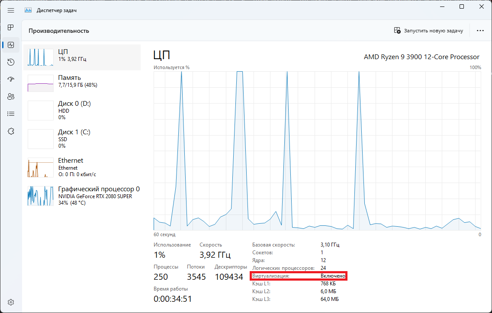</center>
### Если виртуализация отключена, ее необходимо включить в BIOS вашего ПК. Как это сделать - можно найти на просторах интернета. 
### 2. Устанавливаем необходимые драйвера на свою видеокарту: 
* [Драйвера на видеокарты nVidia](https://www.nvidia.ru/Download/index.aspx?lang=ru)
* [Драйвера на видеокарты AMD](https://www.amd.com/en/support)
* [Драйвера на видеокарты Intel](https://www.intel.com/content/www/us/en/search.html#sort=relevancy&f:@tabfilter=[Downloads]&f:@stm_10385_en=[Graphics]) (для корректной загрузки необходимо использовать proxy или vpn, так как на территории РФ Intel прекратил обслуживание клиентов)
### 3. Устанавливаем [все пакеты Visual C++](https://www.techpowerup.com/download/visual-c-redistributable-runtime-package-all-in-one/), распаковываем архив и запускаем .bat-файл. Он установит все необходимое.
### 4. Устанавливаем [Visual Studio и Visual Studio Code](https://visualstudio.microsoft.com/ru/free-developer-offers/) (я пользуюсь именно им, так как почему-то кажется наиболее удобным).
### 5. В поиске находим "Включение или отключение компонентов Windows", <center>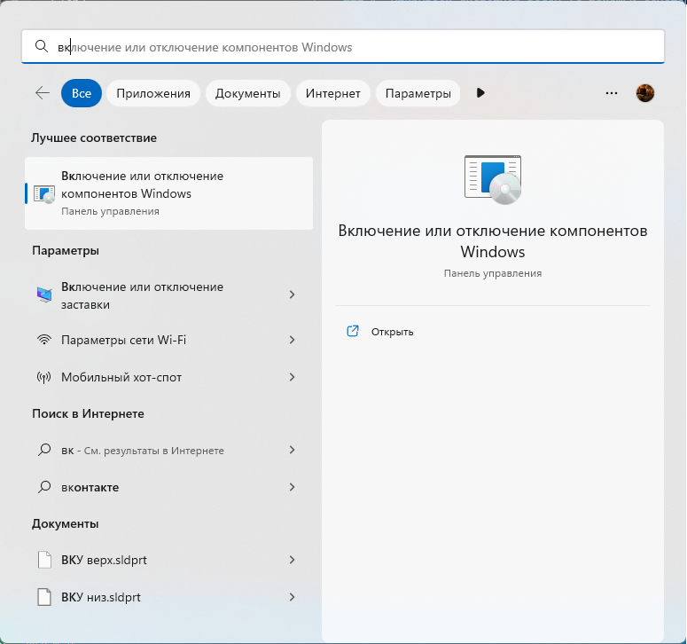</center>
### заходим в них и ставим галочки на следующие параметры:
* Hyper-V
* Платформа виртуальной машины
* Подсистема Windows для Linux 
<center>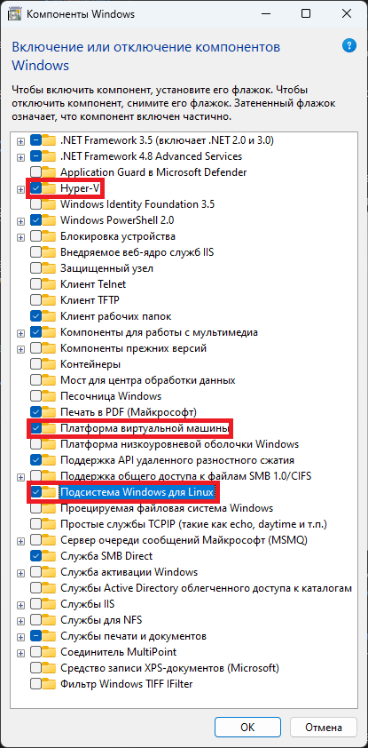</center>
### нажимаем "ОК", система предложит перезагрузиться, что мы и делаем. <center>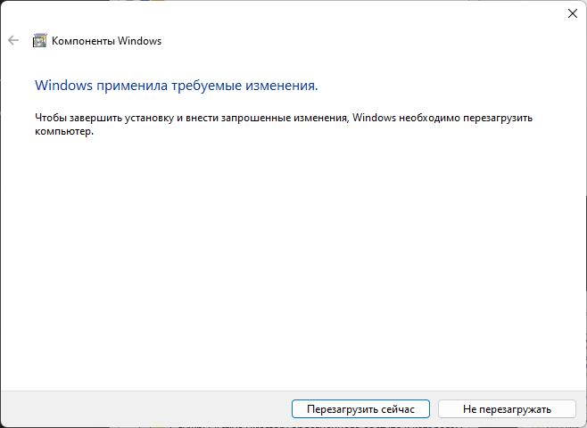</center>

---------
<center><h2> Установка Linux в WSL2 </h2></center>

### 1. Запускаем PowerShell и проверяем доступность дистрибутивов:
```
wsl -l -o
```

<center>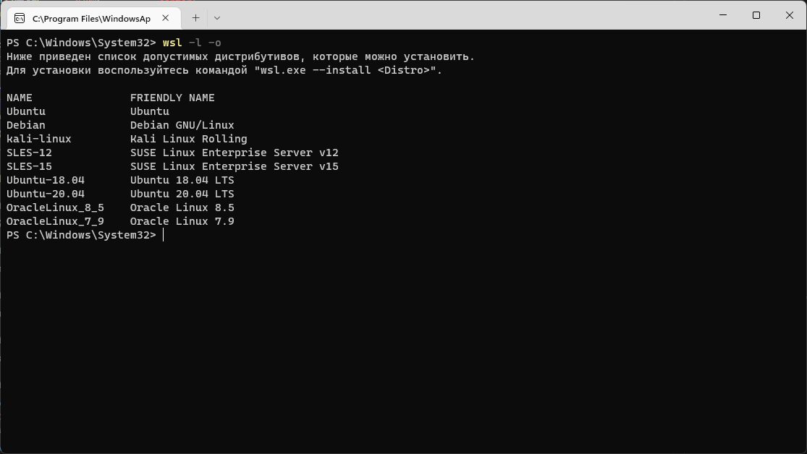</center>

### 2. Я буду ставить Ubuntu. Вы можете поставить любой, однако дальнейшее описание будет именно в рамках Ubuntu. Вводим следующую команду и ждем, пока пройдет установка:
```
wsl --install Ubuntu
```

### 3. После достаточно быстрой установки выскочит окошко, где потребуется ввести желаемый вами логин и два раза пароль:

<center>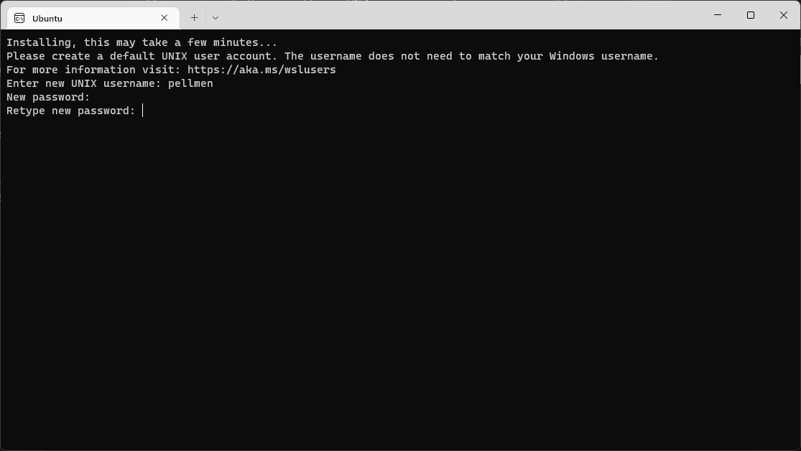</center>

### 4. (необязательный пункт) Перезагружаем компьютер. (по крайней мере это нужно у меня, иначе Ubuntu не хочет обновлять репозитории).
---------
<center><h2> Установка необходимых пакетов в Linux </h2></center>

### 1. После перезагрузки запускаем Linux. Это можно сделать двумя способами:
* с помощью меню "Пуск". В меню появится "Ubuntu";
* с помощью PowerShell, введя просто 
```
wsl
```
Если установленно несколько дистрибутивов, то запустить конкретный можно так:
```
wsl -d Ubuntu
```
<center>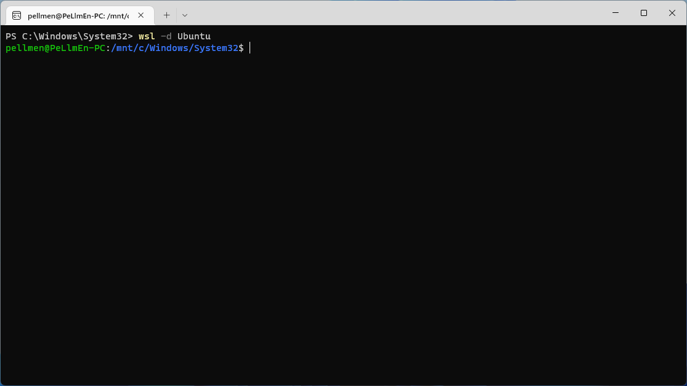</center>
однако во этом случае мы находимся не совсем в нужной нам папке. Чтоб перейти в нужную, необходимо прописать следующее:

```
cd /home/<ваш логин>
```

В моем случае это выглядит так:

```
cd /home/pellmen
```

### 2. Обновим имеющийся дистрибутив Linux:
```
sudo apt update && sudo apt -y upgrade
```
### 3. Установим и сразу обновим pip:

```
sudo apt install pip -y
```
```
pip install --upgrade pip
```
### 4. Устанавливаем CUDA Toolkit и cuDnn:
Поочередно вводим в терминале команды:
```
wget https://developer.download.nvidia.com/compute/cuda/repos/wsl-ubuntu/x86_64/cuda-wsl-ubuntu.pin
```
```
sudo mv cuda-wsl-ubuntu.pin /etc/apt/preferences.d/cuda-repository-pin-600
```
```
wget https://developer.download.nvidia.com/compute/cuda/11.8.0/local_installers/cuda-repo-wsl-ubuntu-11-8-local_11.8.0-1_amd64.deb
```
```
sudo dpkg -i cuda-repo-wsl-ubuntu-11-8-local_11.8.0-1_amd64.deb
```
```
sudo cp /var/cuda-repo-wsl-ubuntu-11-8-local/cuda-*-keyring.gpg /usr/share/keyrings/
```
```
sudo apt-get update
```
```
sudo apt-get -y install cuda
```
```
rm cuda-repo-wsl-ubuntu-11-8-local_11.8.0-1_amd64.deb
```
```
sudo apt install nvidia-cuda-toolkit
```
### 5. Установим Anaconda
* Проверяем [на сайте Anaconda](https://www.anaconda.com/products/distribution#Downloads) последнюю версию для Linux и копируем ссылку на нее.

<center>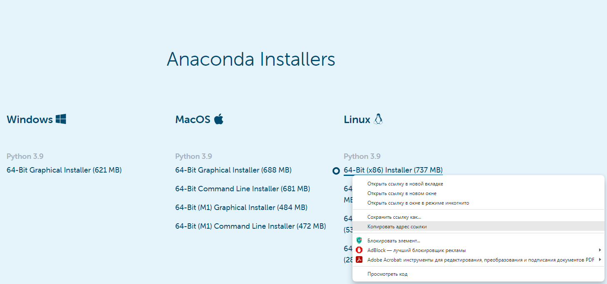</center>

* Вставляем ссылку в следующую команду, чтобы скачать установочный файл:
```
curl --output anaconda.sh <ссылка на последнюю версию Anaconda>
```
На момент написания гайда команда имеет следующий вид:
```
curl --output anaconda.sh https://repo.anaconda.com/archive/Anaconda3-2022.10-Linux-x86_64.sh
```
* Устанавливаем Anaconda:
```
bash anaconda.sh
```
Вначале установки придется зажать "Enter", чтобы пролистать лицензионное соглашение. В конце лицензионного соглашения необходимо написать "yes" и нажать "Enter". Далее появится предложение изменить место установки. Если не хотите менять месторасположение установки, как я, просто нажимаете "Enter". На этом все - установка начнется.

В конце установки настоятельно рекомендую ответить <code>yes</code>.
* Перезапускаем терминал с Linux.
* Удаляем ранее скаченный установочник:
```
rm anaconda.sh
```
* Сразу обновим ее:
```
conda upgrade --all -y
```
### 6. Установим TensorFlow
* Создадим новую среду. Название можно менять на желаемое. Я назвал <code>GPU</code>:
```
conda create --name GPU
```
<center>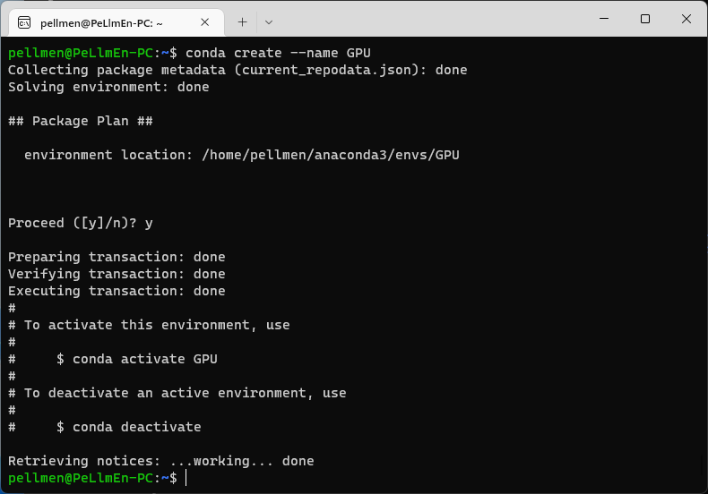</center>

* Активируем её:
```
conda activate GPU
```
* Устанавливаем через Anaconda нужные пакеты CUDA и cuDNN согласно [таблице](https://www.tensorflow.org/install/source#gpu)

<center>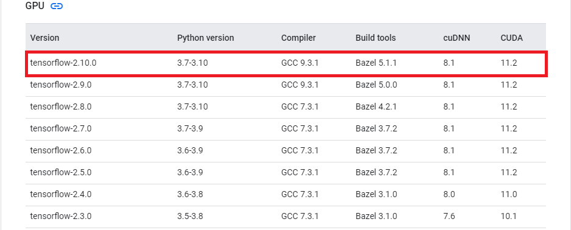</center>

```
conda install -c conda-forge cudatoolkit=11.2 cudnn=8.1.0 -y
```
* Настроим системные пути:
```
export LD_LIBRARY_PATH=$LD_LIBRARY_PATH:$CONDA_PREFIX/lib/
```
```
mkdir -p $CONDA_PREFIX/etc/conda/activate.d
```
```
echo 'export LD_LIBRARY_PATH=$LD_LIBRARY_PATH:$CONDA_PREFIX/lib/' > $CONDA_PREFIX/etc/conda/activate.d/env_vars.sh
```
* Устанавливаем TensorFlow
```
pip install tensorflow-gpu
```
* Проверяем работоспособность:
```
python3 -c "import tensorflow as tf; print(tf.config.list_physical_devices('GPU'))"
```
<center>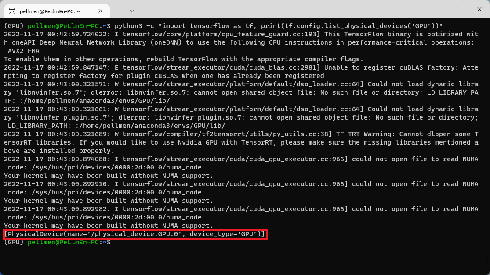</center>

Главное, чтоб отобразилось то, что выделено красным - это означает, что TensorFlow увидел наш GPU. Если появляются какие-то предупреждения, как у меня, то это не критично. можно скрыть их следующей командой:
```
export TF_CPP_MIN_LOG_LEVEL="2"
```
### 7. Установим PyTorch:
```
conda install pytorch torchvision torchaudio pytorch-cuda -c pytorch -c nvidia
```
### 8. Установим необходимые для работы зависимости:
```
conda install jupyter -y
```
```
pip install -U scikit-learn tqdm torchsummary matplotlib
```
### 9. Настроим VSCode
* Запускаем и заходим во вкладку "Расширения".
* Устанавливаем расширение WSL.
<center>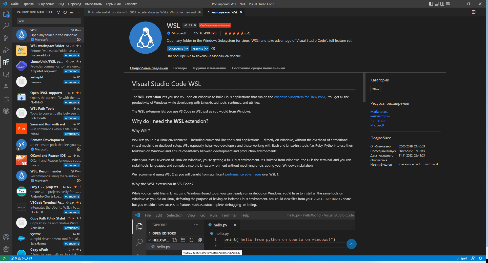</center>

* После установки нажимаем в левом нижнем углу VSCode на зелененькую область - выскочит окно, в котором можно выбрать запуск через WSL.
<center>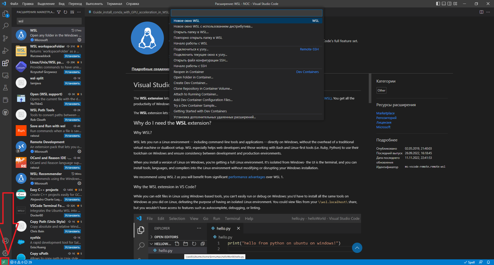</center>

* Запустив VSCode в WSL, необходимо снова зайти во вкладку расширения и скачать Python и Jupyter.
<center>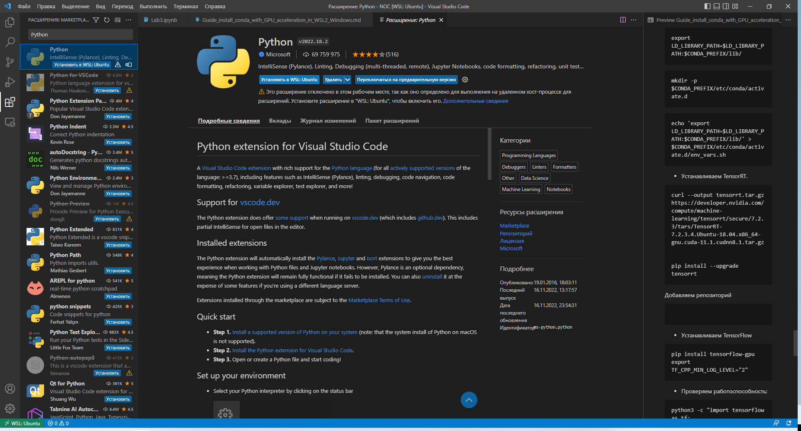</center>
<center>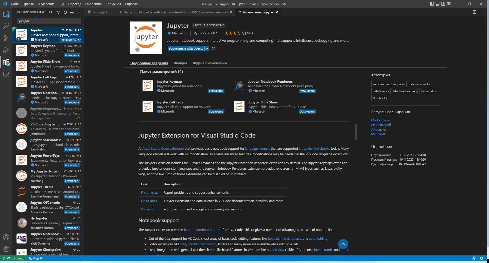</center>

* При попытке запуска кода VSCode будет предлагать доставить необходимые пакеты - не отказываемся, везде отвечаем "да, установить".
* После того, как все установиться, желательно перезапустить VSCode. И наконец-то мы сможем выбирать ядра, на которых будем запускать свои программы. Я конечно же выбираю то, которое настроил - <code>GPU</code>
<center>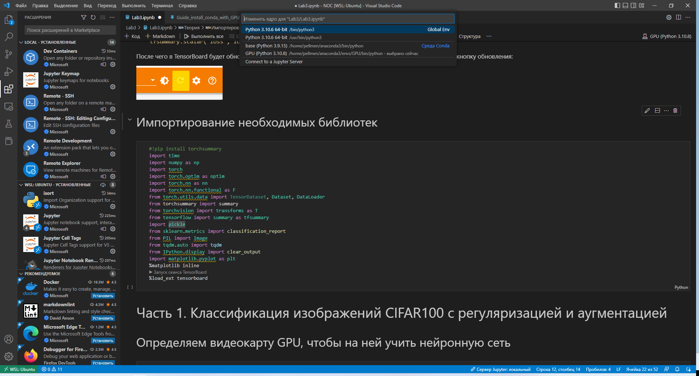</center>

* Радуемся хорошему приросту скорости обучение с использованием мультпотока под Windows! (PS: colab эту модель считает 5-6 мин, то же время я получаю без мультипотока из-под Windows) 
<center></center>